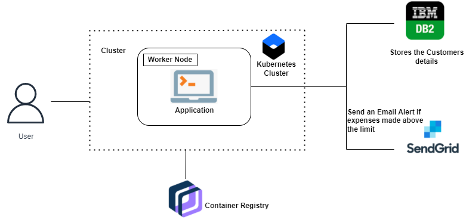

# Personal Expense Tracker Application

Software Required: Python, Flask , Docker System Required: 8GB RAM,Intel Core i3,OS-Windows/Linux/MAC ,Laptop or Desktop

In simple words, personal finance entails all the financial decisions and activities that a Finance app makes your life easier by helping you to manage your finances efficiently. A personal finance app will not only help you with budgeting and accounting but also give you helpful insights about money management.

Personal finance applications will ask users to add their expenses and based on their expenses wallet balance will be updated which will be visible to the user. Also, users can get an analysis of their expenditure in graphical forms. They have an option to set a limit for the amount to be used for that particular month if the limit is exceeded the user will be notified with an email alert.

Submission for IBM Project Nalaiyathiran

## Technical Architecture



## Development

### Setup

To install dependencies we will setup a python environment

```
python -m venv venv
. venv/bin/activate
pip install -r requirements.txt
```

To configure secrets and environment variable, create a file `instance/config.py`. Add your secrets to `.env` file in the root of your project.

```
# instance/config.py
from os import environ

CONN_STR = environ.get('CONN_STR')

SECRET_KEY = environ.get('SECRET_KEY')

ADMIN_MAIL = environ.get('ADMIN_MAIL')

MAIL_API_KEY = environ.get('MAIL_API_KEY')

MAIL_API_SECRET = environ.get('MAIL_API_SECRET')

COS_ENDPOINT = environ.get('COS_ENDPOINT')

COS_INSTANCE_CRN = environ.get('COS_INSTANCE_CRN')

COS_API_KEY_ID = environ.get('COS_API_KEY_ID')

COS_BUCKET_NAME = environ.get('COS_BUCKET_NAME')

COS_HMAC_ACCESS_KEY = environ.get('COS_HMAC_ACCESS_KEY')

COS_HMAC_SECRET_KEY = environ.get('COS_HMAC_SECRET_KEY')
```

`.env` file

```
CONN_STR=
SECRET_KEY=
ADMIN_MAIL=
MAIL_API_KEY=
MAIL_API_SECRET=
COS_ENDPOINT=
COS_INSTANCE_CRN=
COS_API_KEY_ID=
COS_BUCKET_NAME=
COS_HMAC_ACCESS_KEY=
COS_HMAC_SECRET_KEY=
```

To initialize database

```
flask --app expense_tracker init-db
```

To run flask app locally

```
flask --app expense_tracker run --host 0.0.0.0
```

To run tailwindcss(only during development). Make sure to install npm dependencies.

```
npx tailwindcss -i expense_tracker/static/src/input.css -o expense_tracker/static/style.css --watch
```

### Building python wheel package

```
pip install -e .
python setup.py bdist_wheel
```

### Docker

To create docker image:

```
docker build -t expense_tracker .
```

To run a container:

```
docker run -dp 8080:8080 --env-file .env expense_tracker
```

### Kubernetes

Create a `expense-tracker.secrets.yaml` file containing secret required by `expense-tracker.deployment.yaml`.

```
apiVersion: v1
kind: Secret
metadata:
  name: expense-tracker-secret
type: Opaque
data:
  CONN_STR:
  SECRET_KEY:
  ADMIN_MAIL:
  MAIL_API_KEY:
  MAIL_API_SECRET:
  COS_ENDPOINT:
  COS_INSTANCE_CRN:
  COS_API_KEY_ID:
  COS_BUCKET_NAME:
  COS_HMAC_ACCESS_KEY:
  COS_HMAC_SECRET_KEY:
```

Make sure to `base64` encode the secrets.

To deploy expense_tracker using kubernetes:

```
kubectl apply -f kubernetes/expense-tracker.secets.yaml
kubectl apply -f kubernetes/expense-tracker.deployment.yaml
kubectl apply -f kubernetes/expense-tracker.service.yaml
```
